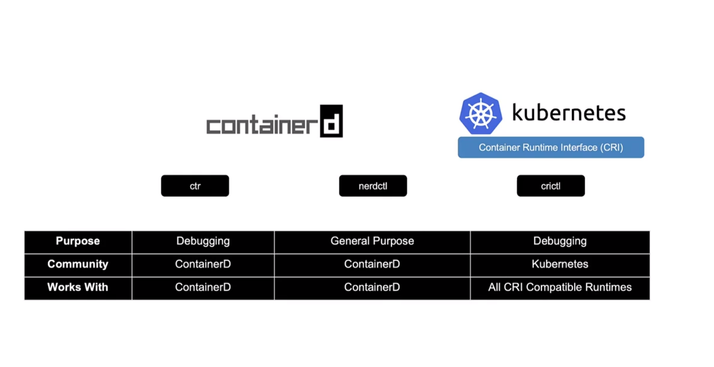

# ⭐ Core Concepts

- In the first section, we start with the core concepts.

- We look at the cluster architecture at a high level and then look at some of the API primitives, such as the basic concepts like Pods, ReplicaSets, Deployments followed by services.

## 📝 Cluster Architecture

- Kubernetes Architecture
- ETCD in Kubernetes
- Kube-API Server
- Controller Managers
- Kube Scheduler
- Kubelet
- Kube Proxy

---

- The purpose of Kubernetes is to host your applications in the form of containers in an automated fashion so that you can easily deploy as many instances of your application as required and easily enable communication between different services within your application.

- The Kubernetes cluster consists of a set of nodes, which may be physical or virtual, on premise or on cloud.

- The `master node` is responsible for managing the Kubernetes cluster, storing information regarding the different nodes, planning which containers goes where, monitoring the nodes and containers on them, etc ...

  - `Etcd` is a database that stores information in a key value format.
  - `Kubernetes-scheduler` it identifies the right node to place a container on based on the containers resource requirements, the worker nodes capacity or any other policies or constraints, such as taints and tolerations or node affinity rules that are on them.
  - `Controller-Manager`  ***The node controller*** takes care of nodes, They're responsible for onboarding new nodes to the cluster, handling situations where nodes become unavailable or get destroyed, and ***the replication controller*** ensures that the desired number of containers are running at all times in a replication group .
  - `Kube API server` the primary management component of Kubernetes, responsible for orchestrating all operations within the cluster. It exposes the Kubernetes API, which is used by external users to perform management operations on the cluster, as well as the various controllers to monitor the state of the cluster and make necessary changes as required and by the worker nodes to communicate with the server.

- We are working with containers, Containers are everywhere, so we need everything to be container compatible, So we need these software that can run containers and that's the container runtime engine, a popular one being Docker.So we need Docker, or it's supported equivalent installed on all the nodes in the cluster, including the master nodes, if you wish to host the controlling components as containers. Now, it doesn't always have to be Docker. Kubernetes supports other runtime engines as well like ContainerD, a Rocket.

- The `Worker Node` Contains:
  - `Kubelet`  is an agent that runs on each node in a cluster. It listens for instructions from the Kube API server and deploys or destroys containers on the nodes as required.
  - `Kube Proxy Service` Communication between worker nodes and ensures that the necessary rules are in place on the worker nodes to allow the containers running on them to reach each other.

---
### Docker-vs-ContainerD

- `Container Runtime Interface (CRI)` CRI allowed any vendor to work as a container runtime for Kubernetes as long as they adhere to the OCI standards.

- `Open Container Initiative (OCI)` it consists of an image spec and a runtime spec. Image spec means the specifications on how an image should be built,and the runtime spec defined the standards on how any container runtime should be developed.

- Docker consists of multiple tools that are put together.
For example, the `Docker CLI`, the `Docker API`,the build tools that help in building images.There was support for `volumes`, `auth`, `security`, and finally, also the container runtime called runc and the `demon` that managed runc, and that was called `containerd`.

- So you can now install containerd on its own without having to install Docker itself. So if you don't really need Docker's other features you could ideally just install containerd alone.

- Now once you install containerd, it comes with a command line tool called `ctr`, and this tool is solely made for debugging containerd

- `CRI` It's only to be used for some special debugging purposes.

- So a better alternative recommended is the nerd control tool or `nerdctl` tool.

- another command line utility known as `crictl` or cri control.

- So the cri control is a command line utility that is used to interact with the CRI compatible container runtime. So this is kind of an interaction from the Kubernetes perspective. So this tool is kind of developed and maintained by the Kubernetes community, and this tool works across all the different container runtimes.

- It's only to be used for some special debugging purposes.

---

### ETCD For Beginners

